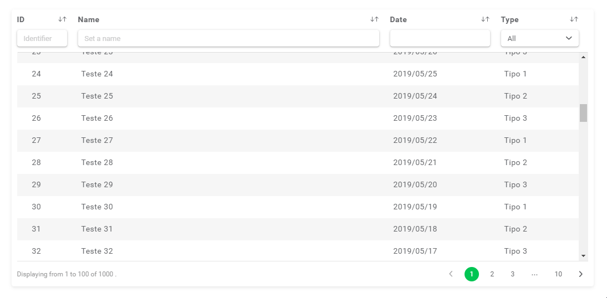

# [AgTable](https://ericferreira1992.github.io/ag-table) (for Angular 13+)

A simple, clean and lightweight data table component for Angular.
**Compatible**: Angular **13**

## Why AgTable?

**AgTable** is an alternative for developers who need agility and efficiency while coding.
With **AgTable** it is possible to create a fully functional data table with minimum effort. With an well elaborated structure, there is no need to create compronents for columns or cells, as some other data table components require.

## Why is it so good?

The reasons for using **AgTable** are many, but some features make it stand out from other existing data-tables solutions:

- Virtual scrolling
- High performance while displaying thousand of records
- Filtering, sorting and paginating are possible either on client or server side
- Allows you to view data obtained from the server
- Data pagination with infinity scroll or regular pagination
- Does not force you to create components to customize columns and cells
- Column sizes are customizable
- Much more;

### [Get started](https://ericferreira1992.github.io/ag-table)

### [Live demo](https://ericferreira1992.github.io/ag-table/#/demo/client-side)

### [Documentation / API](https://ericferreira1992.github.io/ag-table/#/api)

### Preview

### Contribuitors
- @ericferreira1992